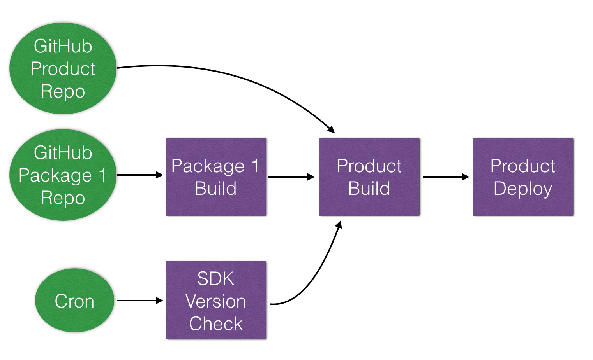

# Beaver CI User Guide
## Overview
Beaver is an open source continuous integration and delivery (CI/CD) system. CI is a practice of integrating changes in a software frequently possibly performing build and test on every change or commit. And CD is to ensure that a software is deliverable at any time in doing so. A CI/CD system assists implementation of such a practice by performing automated build, test, and deployment of software in response to various events including code changes.

## Why Beaver?
Beaver is different from other CI/CD systems in the following aspects:
* Cloud native
* Flexible
* Extensible

### Cloud Native
CI/CD is by nature a good fit for public cloud.

* **Low cost**: A CI/CD system is most of time just on standbye without performing any useful work. Dedicating machines to CI/CD is almost always a waste of the resources due to such underutilization. On public clouds, you only pay the resource you used.
* **Low maintenance burden**: A CI/CD system is usually not a core competency of any development, but must be kept up not to hinder development. In public clouds, there are many managed components that are required to implement a CI/CD system, such as database, storage, and web server, and Beaver is designed to leverage them from the start.
* **Flexible test environment setup**: setting up an ideal test environments on premise is not always possible due to various factors including setup cost. On public clouds, you may spin up and shut down when done servers and mobile devices of differing architectures and OSes in whatever quantity required. 

Beaver leverages a recent addition to the offerings of popular public cloud providers, the serverless architecture. AWS Lambda, Azure Functions, and Google Cloud Functions are all products for enabling the serverless architecture. In the architecture, you do not pay while your system is just on standby. Pay only when something is in progress. Also, you only provide codes to run in response to external requests and public cloud providers ensure them up instead of you. 

Upon receiving events from outside, Beaver spins up virtual machines in public clouds for performing builds and tests, and shuts them down when done. Since some public clouds meter the usage of virtual machines in minutes, the cost involved can be extremely minimized.

### Flexible
In today's standard, a simple flat CI/CD pipeline of cloning a single source code repository, building it, running tests on single environment, and uploading single artifact produced by the previous step to a server is no longer enough. For example, a software may involve multiple source repositories, require tests on more than one CPU architectures, and must be packaged for differnt OSes and package managers.

Beaver is designed to make construction of flexible pipelines possible. It supports event types other than source code changes such as periodic triggers and changes in the language runtime. And execution of tasks can be ochestrated with conditionals, sequential and parallel combinators over multiple source code repositories in a project.

### Extensible
Beaver is designed to be extensible. The extensibility also comes with reusability. Other CI systems rely on shell scripts in describing jobs to be done and don't provide a means to create and share with other users reusable packages of codes that extend various aspects of the CI systems.

Beaver is different in that regard, since it is written and designed to be extended in high level languages including Dart instead of shell scripts. So extensions can manage its external dependencies such as external libraries, and shared on a package server for other users both within and outside your organization. Also we have ensured that extensions built in different languages can be composed with each other in a seamless way.

## Key Concepts
There are a few key concepts to understand before using Beaver:
* Trigger
* Task
* Project

### Trigger
A trigger is an external event notified to Beaver that initiates an execution of tasks. A typical trigger type is a webhook delivered to Beaver on a source code change from GitHub. Examples of triggers are as follows:
* GitHub webhooks: creation of branches, tags, and pull requests. Push of new commits.
* Periodic triggers (like cron)
* Changes in files stored in cloud storage

Underneath, triggers are delivered to Beaver via either HTTP(S) or periodic checks, even though other mechnisms supported by the underlying serverless facility can be leveraged. For the two standard trigger delivery mechanisms, `TriggerParser` can be implemented to extend the set of trigger types supported by Beaver.

After being parsed, a trigger is represented with the following components:
* Event: an identifier telling type of the trigger
* URL: a URL from which the trigger is originated (e.g. URL to the source repository)
* Payload: key-value pairs containing specifics of the trigger, which are referenced when configuring which tasks to be executed

### Task
A task is a composable action in CI/CD workflows. In Beaver, every action is a task ranging from a simple action of deleting a file to a composite action of performing an idiomatic build and test procedure for a C++ project. Even accesses to Beaver-provided services are modeled as tasks.

Currently a task can only be written in Dart. As such one of the major ways to create a composite task (that is, composing tasks) is also via Dart code. But this practice is likely to change in the near future. We plan to provide DSLs (Domain Specific Languages) for composing tasks.

For convenience, tasks can be composed in sequence or parallel or various other ways using combinator tasks in configuration files written in YAML. See the [Project Configuration](#project-configuration).    

### Project
A project is a collection of related triggers and tasks. Since triggers may originate from and tasks act on multiple source code repositories, a project may involve more than one source repositories.

There is a configuration file in YAML associated with every project. It is where triggers and tasks are wired. For details, see [Project Configuration](#project-configuration)



## Basic Workflows
### Setting Up Beaver to the Cloud
#### Creating a New Beaver Instance in the Cloud
```
$ beaver_admin setup -c credentials_path cloud_project_name
```

#### Getting Beaver Endpoint
```
$ beaver_admin describe cloud_project_name
https://us-central1-beaver-ci.cloudfunctions.net/beaver
```

### Setting up Beaver Client
```
$ beaver setup https://us-central1-beaver-ci.cloudfunctions.net/beaver
```

### Creating Project
```
$ beaver create beaver_demo
Created successfully!
```

### Preparing Project Configuration
Project configurations are described in YAML as shown below:
```yaml
project_name: beaver_demo
description: "Demo project for beaver-ci."

triggers:
  - url: "https://github.com/fluidic/beaver_demo"
    type: github
    events: ["github_event_push"]
    task:
      name: my_build
      args: ["beaver_demo", "trigger:payload.head_commit.id"]
```
The above configuration designates to run a task named `my_build` with the given arguments when there was code push to the GitHub repository at the given URL (`https://github.com/fluidic/beaver_demo`).

For the details of how to write project configuration files, see [Project Configuration](#project-configuration).

### Uploading Project Configuration
```
$ beaver upload -c beaver.yaml beaver_demo
Uploaded successfully!
Don't forget to add webhook https://us-central1-beaver-ci.cloudfunctions.net/beaver/github/beaver_demo \
to the GitHub repo "https://github.com/fluidic/beaver_demo"
```

Currently Beaver does not automatically set a webhook up to the relevant GitHub repositories. So be sure to manually add the URL shown when uploading a project configuration.

### Checking Build Result
```
$ beaver get-results -b 0 beaver_demo
beaver_demo
 - Build Number        : 0
 - TaskInstance Status : success
 - Task Status         : success
 - Trigger Event       : github_event_create_branch
 - Trigger URL         : https://github.com/fluidic/beaver
 - Log                 :
 ```

### Listing All Projects
```
$ beaver list
beaver_demo
foo
bar
```

### Getting Project Details
```
$ beaver describe beaver_demo
Configuration:
  - ...
  - ...

Endpoints:
  - ...
  - ...
```

### Deleting Projects   
```
$ beaver delete beaver_demo
Deleted successfully!
```

## Project Configuration
```yaml
- name: build_by_push
  type: github
  url: "https://github.com/fluidic/beaver_demo"
  events: ["github_event_push"]
  task:
    - name: git
      args: ["clone", "trigger:url"]
    - name: git
      args: ["checkout", "trigger:payload.head_commit.id"]
    - name: pub
      args: ["get"]
    - name: pub
      args: ["run", "test"]
    - name: mail
      args: ["dev@fluidic.io"]
```

```yaml
- name: daily_build_by_cron
  type: cron
  task:
    - name: git
      args: ["clone", "trigger:url"]
    - name: pub
      args: ["get"]
    - name: pub
      args: ["run", "test"]
    - name: mail
      args: ["dev@fluidic.io"]
```

```yaml
- name: sdk_version_check
  type: cron
  task:
      - name: version_check
        args: ["dart"]
      - name: trigger
        args: ["daily_build_by_cron"]
```

## Bundled Tasks
* Archiving: `gunzip`, `unzip`, `untar`, `bunzip2`, ...
* File operations: `copy`, `delete`, `mkdir`, `move`, `rename`, `touch`, ... 
* HTTP: `download`, `post`
* Executing shell: `shell`
* Source version control: `git`
* Accessing cloud services: `upload to storage` 
* Notifications: `mail`

## Language Specifics
### Dart
A set of Dart specific tasks are provided:
* Installing SDK
* Executing `pub` command

## Extending Beaver
There are two types of extensions in Beaver. One is `TriggerParser`. The other is `Task`.

### Writing `TriggerParser`
```Dart
@TriggerParserClass('github')
class GitHubTriggerParser implements TriggerParser {
  @override
  Iterable<String> getMainEvents() {
    return _eventMap.keys;
  }

  @override
  ParsedTrigger parse(Context context, Trigger trigger) {
    context.logger.fine('GitHubTriggerParser started.');
    final event = _getEvent(trigger.headers, trigger.data);
    final url = _getUrl(trigger.data);
    return new ParsedTrigger(event, url, trigger.data);
  }
  ...
}
```

### Writing `Task`

```Dart
typedef Future<Object> ExecuteFunc(Context context);
```

```Dart
abstract class Task {
  Future<Object> execute(Context context);
}
```

#### Understanding Context
A context is the environment where tasks are executed. It carries around various states common to some or all of tasks, such as ways to access cloud services running Beaver such as databaase, storage, and virtual machines.

```Dart
abstract class Context {
  Config get config;
  Logger get logger;
  ContextPart getPart(String name);

  Storage get storage;
  DatastoreDB get db;
  ComputeApi get compute;
}
```

### Composing Tasks
You may compose other tasks to achieve more complex task at hands. Instead of inventing another concept for it, Beaver leverages tasks to compose other tasks. In Beaver, such tasks used to compose other tasks are called, *combinator*s.

#### seq/par combinators
You may use `seq` for arranging tasks executed in the specified order one after another. Also `par` can be used to fire up tasks at the same time in parallel.

```Dart
@TaskClass('my_task')
class MyTask implements Task {
  MyTask.fromArgs(List<String> args);

  @override
  Future<Object> execute(Context context) => seq([
        new InstallDartSdkTask(withContentShell: true, withDartium: true),
        new PubTask(['get'], processWorkingDir: 'symbol'),
        new PubTask(['run', 'test'], processWorkingDir: 'symbol')
      ]).execute(context);
}
```

